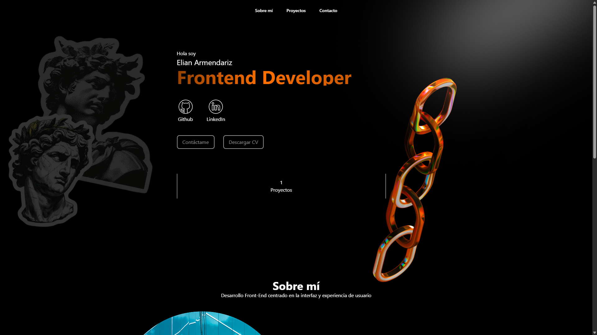
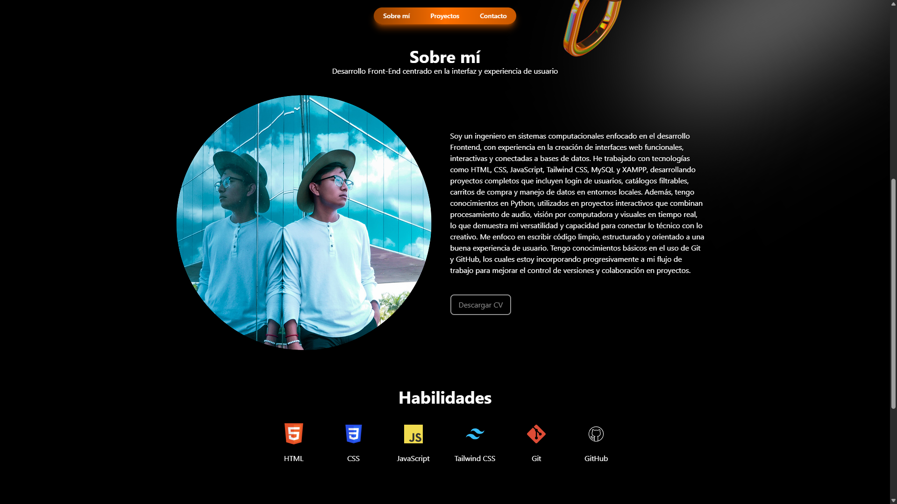

# Portafolio-Elian-Armendariz.github.io
🌐 Portafolio personal de Elian Armendariz como Frontend Developer. Desarrollado con HTML, Tailwind CSS y JavaScript. Incluye secciones sobre mí, habilidades, proyectos y enlaces a mis redes profesionales.

---

## 📸 Capturas de pantalla

---

## 🛠️ Tecnologías utilizadas

- **HTML5**
- **CSS3**
- **Tailwind CSS**
- **JavaScript**
- **Spline (animaciones 3D)**
- **Animate.css**

---

## 🚀 Deploy

Puedes ver el portafolio en línea aquí:  
👉 [Mi Portafolio](https://elianarmendarizz.github.io/Portafolio-Elian-Armendariz/)

---
Portafolio-Elian-Armendariz.
